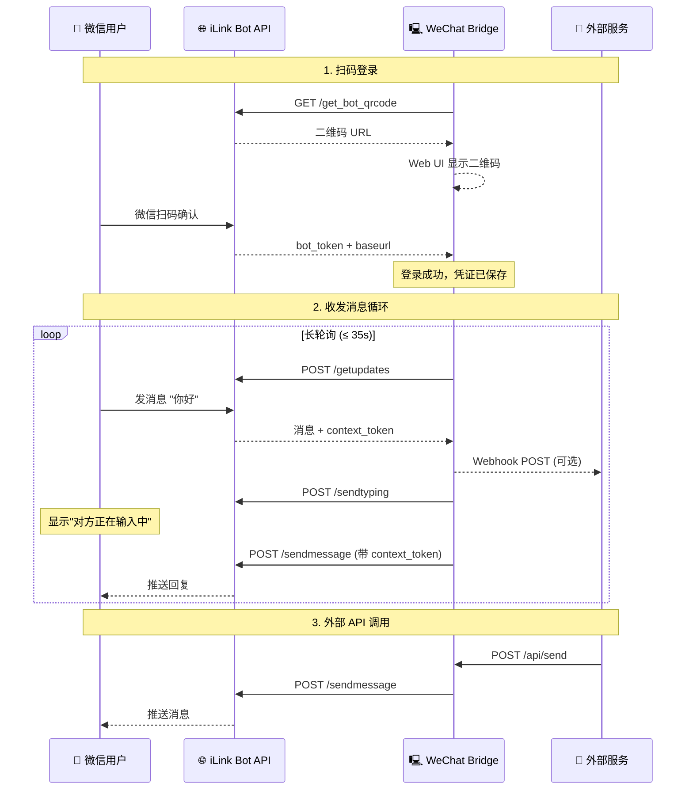

<div align="center">

# 💬 WeChat Bridge

> **"告别笨重且必须常开电脑的 OpenClaw 客户端挂机。专为只需要纯粹微信对话能力、追求极简轻量的你而打造。"**

**基于腾讯 iLink Bot API 的超轻量微信消息桥接服务**

[](https://ghcr.io)
[](https://python.org)
[](LICENSE)

</div>

---

## 🚀 快速开始

### 一键安装（推荐）

**macOS / Linux:**

```bash
curl -fsSL https://raw.githubusercontent.com/yuuouu/WeChat-Bridge/main/install.sh | bash
```

**Windows (PowerShell):**

```powershell
powershell -c "irm https://raw.githubusercontent.com/yuuouu/WeChat-Bridge/main/install.ps1 | iex"
```

脚本会自动检测环境、安装依赖、下载代码、启动后台服务并打开浏览器。

---

## ✨ 功能亮点

- 🔗 **双向消息桥接** — 微信收发消息全打通，支持文本、图片、视频解析及指令路由
- 🌐 **标准 HTTP API** — RESTful 接口，curl 一行即可发微信消息
- 🔔 **反向 Webhook 推送** — 收到微信消息时主动 POST 到你的服务（Dify / FastGPT / Node-RED）
- 💬 **桌面级消息弹窗** — 网页驻留后台时，支持调用主流操作系统的原生系统通知
- 🤖 **内置 AI 助手** — 原生集成 OpenAI / Gemini / Claude / DeepSeek，开箱即用
- 📱 **Web 管理面板** — 扫码登录、实时消息流、图片收发、AI 配置、保活设置，一站式管理
- ⏰ **24h 保活守护** — 智能检测微信通道 24 小时超时，主动提醒防断联
- 🔒 **API Token 鉴权** — 可选的 Bearer Token 认证，保护你的接口安全
- 🐳 **多种部署方式** — 支持 Docker / Windows / macOS / Linux 原生运行

---

<div align="center">
  <table>
    <tr>
      <td align="center"></td>
      <td align="center"></td>
    </tr>
    <tr>
      <td align="center"><em>Web 管理面板 一站式管理</em></td>
      <td align="center"><em>操作系统原生级新消息桌面弹窗</em></td>
    </tr>
  </table>
</div>

---

## ⚠️ iLink API 使用限制

WeChat Bridge 基于腾讯官方 iLink Bot API，该接口存在以下硬性限制：

| 限制项 | 说明 |
|-------|------|
| ⏱️ **24 小时会话窗口** | 用户最后一条消息起算，超过 **24 小时**后 Bot 无法主动下发消息（API 返回 `ret=-2`）。需对方重新发送一条消息才能恢复通道。建议开启保活提醒功能。 |
| 📨 **单用户 10 条/天** | 每个用户每天最多接收 **10 条** Bot 主动下发的消息。超出后 API 会拒绝发送。多播、推送、AI 回复均计入此配额。 |
| 🆔 **需对方先发消息** | 只有对方先发一条消息，系统才能获取其 `user_id`，才能向其主动发送消息。无法向从未交互过的用户发消息。 |

> 💡 **建议**：开启保活提醒（设置面板 → 保活提醒），在通道即将超时前自动向用户发送提醒，引导用户回复以保持 24h 窗口。

> 📝 **关于以上限制**：本项目是首个完整记录并实现了 iLink Bot API 「24h 会话窗口」与「单用户 10 条/天」限制的开源项目。包括自动保活提醒、配额计数、及第 10 条消息末尾附带风控警告等防御机制，均为本项目独立实现。

---

## 🛠️ 其他部署与管理方式

### 🤖 让 AI 帮你部署
直接把下面这句话发给你正在使用的 AI 助手（如 Cursor, Cline 等）：
> `@workspace 请根据我的操作系统，直接执行 https://github.com/yuuouu/WeChat-Bridge 的一键安装脚本帮我部署 WeChat Bridge`

---

### 手动安装

只需 Python 3.10+：

```bash
git clone https://github.com/yuuouu/WeChat-Bridge.git
cd WeChat-Bridge
pip install -r app/requirements.txt
cd app && python main.py
```

### 版本更新与升级

程序每次启动时会自动检测 GitHub 是否有新版本，并在运行日志 (`data/run.log`) 中输出提醒。

你也可以随时手动更新至最新版本：

**原生安装 (Git) 更新：**
```bash
cd WeChat-Bridge
git pull
# 停止旧服务后再次运行
./start.sh  # (Windows 为 start.bat)
```

**Docker 容器更新：**
```bash
cd wechat-bridge
docker compose pull
docker compose up -d
```

**Windows 一键脚本更新：**
如果安装时使用了 PowerShell 一键脚本，可直接在此机器上重新运行该安装命令。脚本会自动进行文件拉取与覆盖、更新依赖并重启服务，你的配置和 `data/` 目录将安全保留。

---

### Docker Compose

```bash
mkdir -p wechat-bridge && cd wechat-bridge

cat > docker-compose.yml <<EOF
services:
  wechat-bridge:
    image: ghcr.io/yuuouu/wechat-bridge:latest
    container_name: wechat-bridge
    restart: unless-stopped
    ports:
      - "5200:5200"
    volumes:
      - ./data:/data
    environment:
      - WEBHOOK_URL=           # 可选：消息推送地址
      - API_TOKEN=             # 可选：API 鉴权 Token
      - TZ=Asia/Shanghai
EOF

docker compose up -d
```

安装完成后，浏览器打开 `http://localhost:5200`，扫码登录即可。

### 服务管理

```bash
# Windows
start.bat          # 后台启动服务并打开浏览器
stop.bat           # 停止后台服务

# macOS / Linux
./start.sh         # 后台启动服务
./stop.sh          # 停止后台服务
```

运行日志保存在 `data/run.log`，可随时查看。

---

## 📡 API 接口

> 如果设置了 `API_TOKEN`，所有 API 请求需携带 `Authorization: Bearer <TOKEN>` 请求头，或在 URL 中添加 `?token=<TOKEN>` 参数。

### 发送消息

```bash
# 最简单：GET 请求，to 省略时自动发给第一个联系人
curl "http://localhost:5200/api/send?text=Hello!"

# POST JSON（指定联系人）
curl -X POST http://localhost:5200/api/send \
  -H "Content-Type: application/json" \
  -d '{"to": "好友名称", "text": "Hello!"}'
```

#### 进阶功能

```bash
# 多播发送：逗号分隔多个联系人（每人间隔 0.5s 防风控）
curl "http://localhost:5200/api/send?to=老婆,家庭群&text=晚饭做好了"

# Markdown 降级：自动将 Markdown 转为微信友好的纯文本
curl "http://localhost:5200/api/send?text=**重要通知**&markdown=1"
```

### 快捷推送（兼容青龙面板 / ntfy / Bark）

这个接口专为第三方系统集成设计。如果未显式指定 `to`，系统会自动将消息发送给通讯录中的**第一个联系人**。

> ⚠️ 注意：每条推送都会消耗目标用户的 10 条/天配额。如果你使用青龙面板或其他定时任务频繁推送，请留意配额限制。

#### 1. 基础调用

```bash
# GET 方式（最简单）
curl "http://localhost:5200/api/push?title=提醒&content=该喝水了&token=YOUR_TOKEN"

# POST JSON
curl -X POST http://localhost:5200/api/push \
  -H "Content-Type: application/json" \
  -H "Authorization: Bearer YOUR_TOKEN" \
  -d '{"to": "好友名称", "title": "提醒", "content": "消息内容"}'
```

#### 2. 在青龙面板中使用

前往青龙面板的 `系统设置` -> `通知设置`，按以下填写：

- **通知方式**：`自定义通知`
- **webhookMethod**：`GET`
- **webhookContentType**：`text/plain`
- **webhookUrl**：`http://你的IP:5200/api/send?text=$content&title=$title` *(如果设置了密码，末尾加 `&token=凭证`)*
- 其他选项保持默认留空。保存后点击测试，即可在微信中收到青龙的测试通知！

<div align="center">
  <table>
    <tr>
      <td align="center"></td>
      <td align="center"></td>
    </tr>
    <tr>
      <td align="center"><em>青龙面板通知设置</em></td>
      <td align="center"><em>微信收到通知效果</em></td>
    </tr>
  </table>
</div>

### 发送图片

支持三种方式上传图片，Web 面板也可直接点击 🖼️ 按钮发送：

```bash
# 方式一：multipart/form-data（最通用，适合脚本和前端）
curl -X POST http://localhost:5200/api/send_image \
  -H "Authorization: Bearer YOUR_TOKEN" \
  -F "to=好友名称" \
  -F "image=@/path/to/photo.jpg"

# 方式二：JSON + Base64（适合程序化调用）
curl -X POST http://localhost:5200/api/send_image \
  -H "Content-Type: application/json" \
  -H "Authorization: Bearer YOUR_TOKEN" \
  -d '{"to": "好友名称", "image": "<base64编码的图片数据>"}'

# 方式三：裸二进制流（适合管道和流式处理）
curl -X POST "http://localhost:5200/api/send_image?to=好友名称&token=YOUR_TOKEN" \
  -H "Content-Type: application/octet-stream" \
  --data-binary @/path/to/photo.jpg
```

### Webhook 适配器

自动识别并格式化第三方服务的告警负载为微信友好文本：

```bash
# 指定类型：Grafana / GitHub / Uptime Kuma / Bark
curl -X POST http://localhost:5200/api/webhook/grafana \
  -H "Content-Type: application/json" \
  -d '{"status": "firing", "alerts": [{"labels": {"alertname": "HighCPU"}}]}'

# 自动检测：系统会根据字段特征自动识别来源
curl -X POST http://localhost:5200/api/webhook \
  -H "Content-Type: application/json" \
  -d '{"title": "下载完成", "message": "文件已就绪"}'
```

支持的 Webhook 格式：`grafana` · `github` · `uptimekuma` · `bark` · 通用自动检测

### 获取联系人列表

```bash
curl -H "Authorization: Bearer YOUR_TOKEN" http://localhost:5200/api/contacts
```

### 健康检查（无需鉴权）

```bash
curl http://localhost:5200/api/status
```

---

## ⚙️ 配置说明

| 环境变量 | 默认值 | 说明 |
|---------|--------|------|
| `PORT` | `5200` | 服务监听端口 |
| `WEBHOOK_URL` | _(空)_ | 收到消息时主动 POST 的目标地址 |
| `API_TOKEN` | _(空)_ | API 鉴权 Token，未设置则无鉴权 |
| `TOKEN_FILE` | `/data/token.json` | 登录凭证持久化路径 |
| `CONTACTS_FILE` | `/data/contacts.json` | 联系人缓存路径 |
| `AI_CONFIG_FILE` | `/data/ai_config.json` | AI 助手配置文件路径 |
| `TZ` | `Asia/Shanghai` | 容器时区 |

### Webhook 推送格式

当配置了 `WEBHOOK_URL` 后，收到微信消息时会向该地址发送 POST 请求：

```json
{
  "source": "wechat-bridge",
  "from_user": "用户ID",
  "from_name": "显示名",
  "text": "消息内容 (图片为 [图片:文件名], 视频为 [视频:文件名])",
  "msg_id": "消息ID",
  "timestamp": 1712345678,
  "msg_type": 1
}
```

---

## 🏗️ 工作原理



---

## 🤖 内置 AI 助手

通过 Web 管理面板一键配置，无需编码：

| 厂商 | 支持模型 |
|------|---------|
| **OpenAI** | GPT-4o, GPT-4o Mini, GPT-4.1 Mini/Nano |
| **Google** | Gemini 2.0 Flash, 2.5 Flash/Pro |
| **Anthropic** | Claude Sonnet 4, Claude 3.5 Haiku |
| **DeepSeek** | DeepSeek Chat (V3), Reasoner (R1) |

微信中发送 `/help` 查看可用指令，`/clear` 清除对话历史。

> ⚠️ AI 自动回复也会消耗每日 10 条配额。如果用户频繁与 AI 对话，可能较快耗尽当天的主动下发次数。

---

## 🙏 鸣谢

本项目在协议研究与底层实现上参考了以下优秀的开源项目，在此表示诚挚的感谢：
- [wechat-ilink-client](https://github.com/photon-hq/wechat-ilink-client) - iLink Bot API 底层协议客户端实现
https://www.npmjs.com/package/@tencent-weixin/openclaw-weixin

---

## 📄 License

MIT License - 自由使用、修改和分发。
