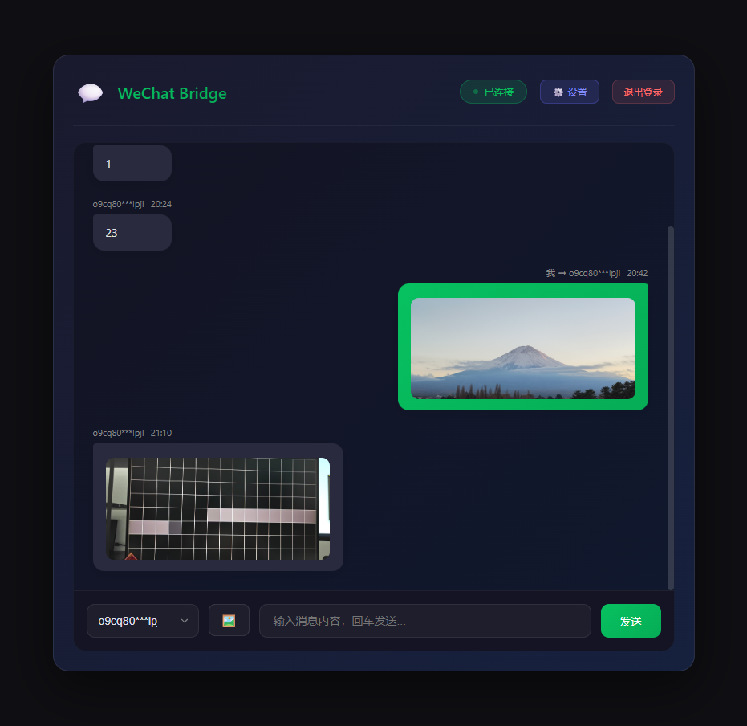
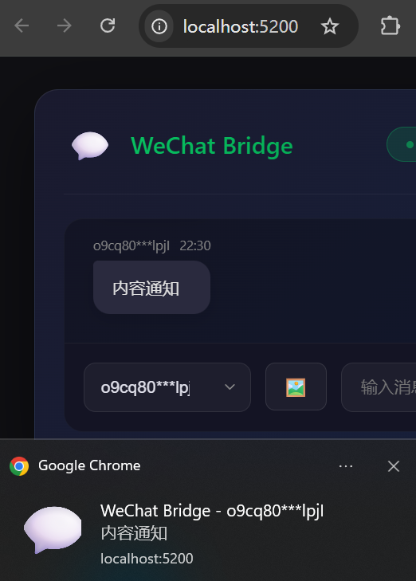
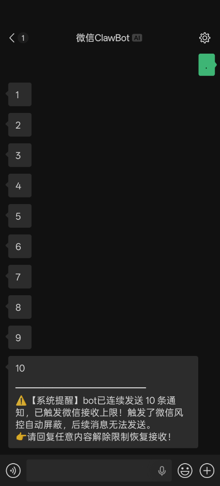
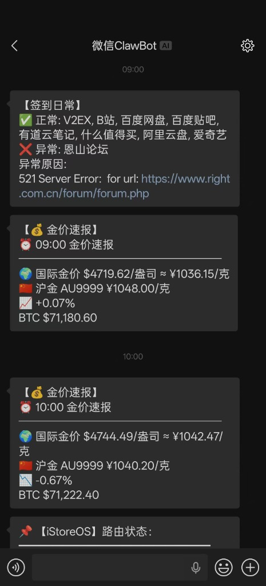
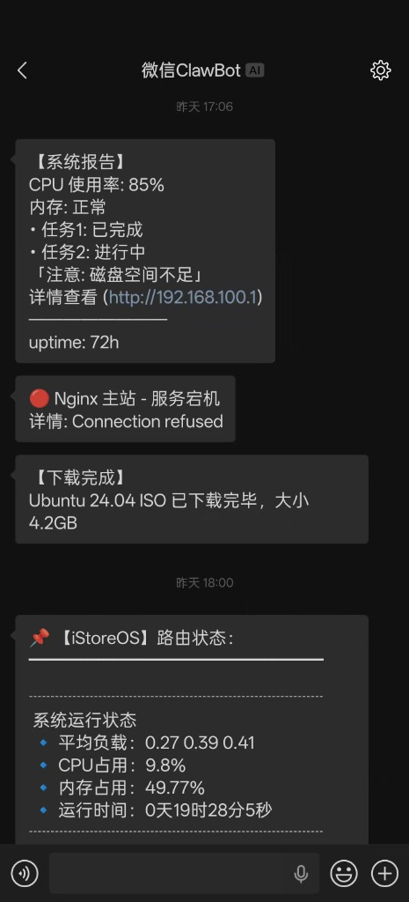

<div align="center">

# 💬 WeChat Bridge

> **"无需安装 OpenClaw，打造纯粹微信对话能力"**

**基于腾讯 iLink Bot API 的超轻量微信消息桥接服务**

**轻量 · 开箱即用 · 跨平台原生运行**

[](https://ghcr.io)
[](https://python.org)
[](LICENSE)

</div>

---

## 🚀 快速开始

**macOS / Linux:**

```bash
curl -fsSL https://raw.githubusercontent.com/yuuouu/WeChat-Bridge/main/scripts/install.sh | bash
```

**Windows (PowerShell):**

```powershell
powershell -c "irm https://raw.githubusercontent.com/yuuouu/WeChat-Bridge/main/scripts/install.ps1 | iex"
```

**Docker:**

```bash
mkdir -p wechat-bridge && cd wechat-bridge

cat > docker-compose.yml <<EOF
services:
  wechat-bridge:
    image: ghcr.io/yuuouu/wechat-bridge:latest
    container_name: wechat-bridge
    restart: unless-stopped
    ports:
      - "5200:5200"
    volumes:
      - ./data:/data
    environment:
      - TZ=Asia/Shanghai
EOF

docker compose up -d
```

安装完成后，浏览器打开 `http://localhost:5200`，扫码登录即可。

> 📖 更多部署方式（手动安装、AI 辅助部署、版本升级）请参阅 **[部署与管理指南](docs/deployment.md)**
>
> 🔁 如果你要把业务逻辑放在外部服务里，请直接看 **[异步回写集成指南](docs/webhook-async-reply.md)**

---

<div align="center">
  <table>
    <tr>
      <td align="center"></td>
      <td align="center"></td>
    </tr>
    <tr>
      <td align="center"><em>Web 管理面板 一站式管理</em></td>
      <td align="center"><em>操作系统原生级新消息桌面弹窗</em></td>
    </tr>
  </table>
</div>

---

## 📸 实际使用效果

<div align="center">
  <table>
    <tr>
      <td align="center"></td>
      <td align="center"></td>
      <td align="center"></td>
    </tr>
    <tr>
      <td align="center"><em>连续 10 条防风控机制</em></td>
      <td align="center"><em>签到日常 / 金价速报</em></td>
      <td align="center"><em>系统报告 / 服务监控 / 路由器状态</em></td>
    </tr>
  </table>
</div>

---

## ✨ 功能亮点

- 🔗 **双向消息桥接** — 微信收发消息全打通，支持文本、图片、视频解析及指令路由
- 🌐 **标准 HTTP API** — RESTful 接口，curl 一行即可发微信消息
- 🔔 **可选外部 Webhook 转发** — 支持在 Web UI 或环境变量中开启，按“仅未知命令 / 全部消息”模式主动 POST 到你的服务（Dify / FastGPT / Node-RED）
- 💬 **桌面级消息弹窗** — 网页驻留后台时，支持调用主流操作系统的原生系统通知
- 🤖 **内置 AI 助手** — 原生集成 OpenAI / Gemini / Claude / DeepSeek，开箱即用
- 📱 **Web 管理面板** — 扫码登录、实时消息流、图片收发、AI 配置、保活设置，一站式管理
- ⏰ **24h 保活守护** — 智能检测微信通道 24 小时超时，主动提醒防断联
- 📦 **受阻消息自动缓存** — 命中 24h 窗口或连续 10 条限制后，消息自动落入本地 SQLite 队列
- 📥 **`/pull` 补拉机制** — 用户回复后发送 `/pull`，按微信长度上限分块拉取未送达消息
- 🏷️ **可见化投递状态** — Web UI 显示 `已缓存 / 已补拉 / 已丢弃 / 可能已送达` 等标签与当前联系人状态
- 🔒 **API Token 鉴权** — 可选的 Bearer Token 认证，保护你的接口安全
- 🐳 **多种部署方式** — 支持 Docker / Windows / macOS / Linux 原生运行

---

## ⚠️ iLink API 使用限制

WeChat Bridge 基于腾讯官方 iLink Bot API，该接口存在以下硬性限制：

| 限制项 | 说明 |
|-------|------|
| ⏱️ **24 小时会话窗口** | 用户最后一条消息起算，超过 **24 小时**后 Bot 无法主动下发消息（API 返回 `ret=-2`）。需对方重新发送一条消息才能恢复通道。建议开启保活提醒功能。 |
| 📨 **连续 10 条限制** | Bot 连续发送 **10 条**消息后，若用户未回复，则无法继续发送。用户回复任意内容后计数器重置，恢复发送能力。多播、推送、AI 回复均计入此计数。 |
| 🆔 **需对方先发消息** | 只有对方先发一条消息，系统才能获取其 `user_id`，才能向其主动发送消息。无法向从未交互过的用户发消息。 |

> 💡 **建议**：开启保活提醒（设置面板 → 保活提醒），在通道即将超时前自动向用户发送提醒，引导用户回复以保持 24h 窗口。

> 📝 **关于以上限制**：本项目已经将 iLink Bot API 的两类硬限制产品化处理。包括自动保活提醒、第 10 条消息末尾附带系统提醒、第 11 条起自动缓存、用户通过 `/pull` 补拉未送达内容，以及 Web UI 中的缓存状态与消息标签展示。

> 🔎 **关于“消息已送达但接口超时”**：部分网络场景下，iLink 可能在微信端已成功投递后才发生 HTTP `ReadTimeout`。当前版本会将这类消息记为“可能已送达”，保留到 SQLite 与 UI 时间线中，避免出现手机已收到但管理面板丢消息的情况。

---

## 📡 API 速览

```bash
# 发消息（一行搞定）
curl "http://localhost:5200/api/send?text=Hello!"

# 发图片
curl -X POST http://localhost:5200/api/send_image \
  -F "to=好友名称" -F "image=@photo.jpg"

# 健康检查
curl http://localhost:5200/api/status
```

> 📖 完整 API 文档（推送接口、青龙面板集成、iStoreOS 路由推送、Webhook 适配器等）请参阅 **[API 接口参考](docs/api-reference.md)**

---

## 🤖 内置 AI 助手

通过 Web 管理面板一键配置，无需编码：

| 厂商 | 支持模型 |
|------|---------|
| **OpenAI** | GPT-4o, GPT-4o Mini, GPT-4.1 Mini/Nano |
| **Google** | Gemini 2.0 Flash, 2.5 Flash/Pro |
| **Anthropic** | Claude Sonnet 4, Claude 3.5 Haiku |
| **DeepSeek** | DeepSeek Chat (V3), Reasoner (R1) |

---

## 📋 微信可用交互指令

在微信中向 Bot 发送以下指令：

| 指令 | 说明 |
|-----|------|
| `/help` | 显示帮助菜单 |
| `/status` | 查看服务状态、发信额度及各项配置 |
| `/uid` | 获取自己的用户 ID |
| `/retry` | 重新生成 AI 回复 |
| `/keepalive [on\|off]` | 开启或关闭 23h 通道提醒 |
| `/ai [on\|off]` | 开启或关闭 AI 自动回复 |
| `/clear` | 清除 AI 对话历史 |
| `/pull` | 拉取当前缓存会话中的未送达消息，按微信长度上限自动分块发送 |

---

## 📚 更多文档

| 文档 | 说明 |
|-----|------|
| **[部署与管理指南](docs/deployment.md)** | 手动安装、Docker、AI 辅助部署、版本升级 |
| **[API 接口参考](docs/api-reference.md)** | 完整 API、青龙面板 / iStoreOS 集成、Webhook 适配器 |
| **[工作原理](docs/architecture.md)** | iLink 协议桥接时序图与核心流程解析 |
| **[更新日志](docs/CHANGELOG.md)** | 版本变更记录 |

---

## 🙏 鸣谢

本项目在协议研究与底层实现上参考了以下优秀的开源项目，在此表示诚挚的感谢：
- [wechat-ilink-client](https://github.com/photon-hq/wechat-ilink-client) 
- [iLink Bot API 底层协议客户端实现](https://www.npmjs.com/package/@tencent-weixin/openclaw-weixin)

---

## 📄 License

MIT License - 自由使用、修改和分发。
