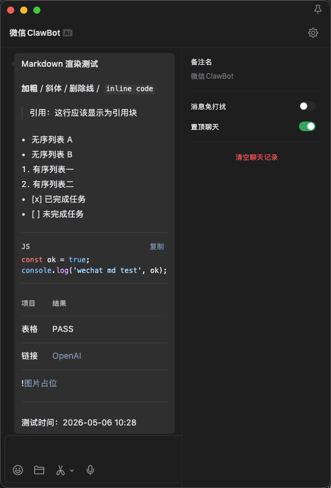
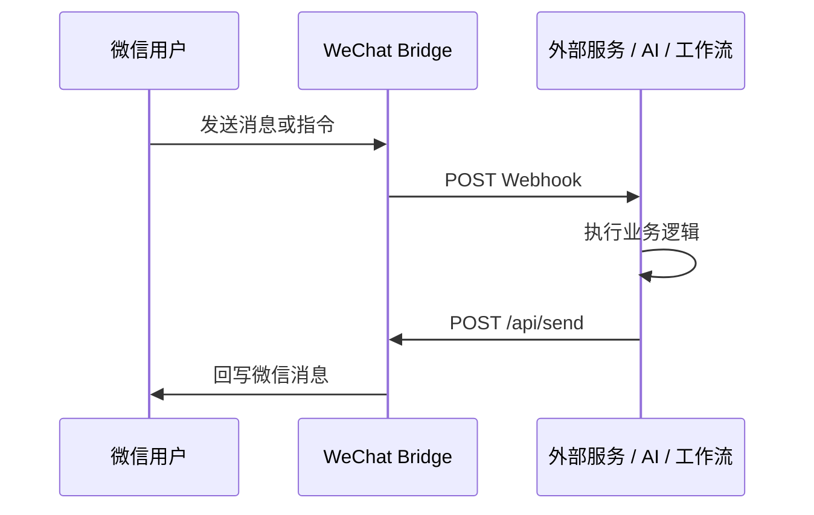

<div align="center">

# 💬 WeChat Bridge

**把微信 Bot 变成可编程的 HTTP 消息通道**

**轻量 · 开箱即用 · 跨平台原生运行**

</div>

---

## 它解决什么问题

WeChat Bridge 适合把微信当成一个轻量、私有、可编程的消息入口：

- **从任意系统发微信**：服务器告警、NAS 下载完成、路由器状态、CI/CD 结果、定时任务报告，都可以 `curl /api/send` 推到微信
- **把 send 接口开放到公网**：通过 HTTPS 域名、反向代理或内网穿透暴露 `/api/send` 后，任何网络里的脚本、云函数、手机快捷指令都能向你的微信 Bot 发消息
- **把微信变成业务前端**：用户在微信里发消息，Bridge 转发到你的 Webhook；业务服务处理后再调用 `/api/send` 异步回写
- **快速接入 AI 助手**：内置 OpenAI / Gemini / Claude / DeepSeek / MiniMax，也支持自定义 OpenAI-compatible 服务
- **本地优先部署**：Docker、Windows、macOS、Linux 都可运行，数据默认保存在本机

---

## 快速开始

**macOS / Linux:**

```bash
curl -fsSL https://wb.yuuou.qzz.io/install.sh | bash
```

**Windows (PowerShell):**

```powershell
powershell -c "irm https://wb.yuuou.qzz.io/install.ps1 | iex"
```

**Docker:**

```bash
mkdir -p wechat-bridge && cd wechat-bridge

cat > docker-compose.yml <<EOF
services:
  wechat-bridge:
    image: ghcr.io/yuuouu/wechat-bridge:latest
    container_name: wechat-bridge
    restart: unless-stopped
    ports:
      - "5200:5200"
    volumes:
      - ./data:/data
    environment:
      - TZ=Asia/Shanghai
      - API_TOKEN=change-this-token
EOF

docker compose up -d
```

启动后打开 `http://localhost:5200`，如果设置了 `API_TOKEN` 先输入访问密码，然后扫码登录即可

更多部署、升级和原生运行方式见 [部署与管理指南](docs/deployment.md)

---

## 使用效果

<div align="center">
  <table>
    <tr>
      <td align="center"></td>
      <td align="center"></td>
      <td align="center"></td>
      <td align="center"></td>
      <td align="center"></td>
    </tr>
    <tr>
      <td align="center"><em>Web 管理面板</em></td>
      <td align="center"><em>连续 10 条保护</em></td>
      <td align="center"><em>签到 / 金价 / 日常推送</em></td>
      <td align="center"><em>系统报告 / 服务监控 / 路由器状态</em></td>
      <td align="center"><em>Markdown 文本渲染</em></td>
    </tr>
  </table>
</div>

---

## 从任意网络发送到微信

本项目最核心的用法是把微信 Bot 变成一个 HTTP 推送网关

### 1. 本机或内网调用

```bash
curl -X POST http://localhost:5200/api/send \
  -H "Authorization: Bearer change-this-token" \
  -H "Content-Type: application/json" \
  -d '{"to": "好友名称或 user_id", "text": "Hello from server"}'
```

参数说明：

- `to`：目标联系人，在微信 Bot 中发送 `/uid` 可获取自己的 `user_id`
- `API_TOKEN`：接口访问密钥；设置后 `/api/send` 等接口必须携带 `Authorization: Bearer <TOKEN>` 或 URL 参数 `?token=<TOKEN>`，公网开放时务必设置
- `MARKDOWN_MODE=normalize`：可选，将 iStoreOS、青龙、Bark 等普通通知整理为 Markdown；不设置时默认按 Markdown 文本发送

如果不传 `to`，系统会尝试发送给通讯录里的第一个联系人；生产环境建议显式传入目标联系人或 `user_id`

### 2. 开放到公网调用

把 `5200` 端口通过反向代理、内网穿透或云服务器安全暴露为 HTTPS 域名，例如：

```text
https://bot.example.com -> http://127.0.0.1:5200
```

随后任何网络都可以调用：

```bash
curl -X POST https://bot.example.com/api/send \
  -H "Authorization: Bearer change-this-token" \
  -H "Content-Type: application/json" \
  -d '{"to": "好友名称或 user_id", "text": "来自公网的微信推送"}'
```

也可以用 GET，适合青龙面板、路由器插件、简单 Webhook：

```bash
curl "https://bot.example.com/api/send?token=change-this-token&to=好友名称&text=任务完成"
```

公网开放建议：

- 务必设置 `API_TOKEN`
- 优先使用 HTTPS
- 不要把无鉴权接口直接暴露到公网
- 更高安全要求下可叠加反向代理鉴权、IP 白名单、Cloudflare Access 或防火墙规则

---

## 典型使用场景

| 场景 | 推荐接入方式 |
|---|---|
| 服务器、NAS、软路由状态推送 | 定时任务或脚本调用 `POST /api/send` |
| 青龙面板、iStoreOS、OpenWrt 通知 | 配置自定义 Webhook URL 指向 `/api/send` 或 `/api/push` |
| Grafana、Uptime Kuma、GitHub 告警 | 调用 `/api/webhook/<type>`，自动格式化为微信友好文本 |
| 手机快捷指令、Tasker、云函数 | 公网 HTTPS 域名 + Bearer Token 调用 `/api/send` |
| 外部 AI / 工作流平台 | 微信消息转发到 Webhook，服务处理后回调 `/api/send` |
| 个人命令中心 | 在微信发送指令，外部服务执行查询、记账、笔记、自动化操作后回写 |

完整接口与平台示例见 [API 接口参考](docs/api-reference.md) 和 [Webhook 示例](docs/webhook-examples.md)

---

## 核心能力

- **标准 HTTP API**：`/api/send`、`/api/send_image`、`/api/push`、`/api/webhook`、`/api/contacts`、`/api/status`
- **双向消息桥接**：微信消息可进入 Web UI、内置 AI 或外部 Webhook；外部服务可异步回写微信
- **Web 管理面板**：扫码登录、实时消息流、联系人缓存、图片收发、AI 配置、Webhook 配置、保活设置
- **桌面通知**：网页驻留后台时，可调用主流操作系统的原生系统通知
- **投递保护**：24h 窗口和连续 10 条限制下，自动缓存受阻消息，并支持 `/pull` 补拉
- **可见化状态**：Web UI 展示 `已缓存 / 已补拉 / 已丢弃 / 可能已送达` 等投递标签
- **API Token 鉴权**：支持 Bearer Token 或 `?token=`，适合公网和第三方集成
- **本地持久化**：SQLite WAL 模式保存消息、联系人、投递状态和配置，适合轻量设备长期运行

---

## API 速览

```bash
# 发文本
curl -X POST http://localhost:5200/api/send \
  -H "Authorization: Bearer YOUR_TOKEN" \
  -H "Content-Type: application/json" \
  -d '{"to": "好友名称或 user_id", "text": "Hello!"}'

# 发图片
curl -X POST http://localhost:5200/api/send_image \
  -H "Authorization: Bearer YOUR_TOKEN" \
  -F "to=好友名称或 user_id" \
  -F "image=@photo.jpg"

# 健康检查
curl http://localhost:5200/api/status
```

完整 API、请求字段、Webhook 适配器、青龙面板和 iStoreOS 配置见 [API 接口参考](docs/api-reference.md)

---

## 双向 Webhook 工作流



如果业务处理耗时较长，推荐异步回写：Bridge 收到消息后立即把事件推给你的服务，你的服务处理完成后再调用 `/api/send`，详见 [异步回写集成指南](docs/webhook-async-reply.md)

---

## 微信侧限制

WeChat Bridge 基于腾讯 iLink Bot API，无法绕过官方接口限制：

| 限制项 | 影响 |
|---|---|
| 24 小时会话窗口 | 用户最后一条消息超过 24 小时后，Bot 不能主动下发消息，需要对方重新发一条消息恢复通道 |
| 连续 10 条限制 | Bot 连续发送 10 条消息后，若用户未回复，继续发送会被阻断；用户回复任意内容后计数重置 |
| 需对方先发消息 | 只有对方先给 Bot 发过消息，系统才能获取 `user_id` 并主动发送 |

项目已把这些限制产品化处理：保活提醒、第 10 条末尾提醒、受阻消息缓存、`/pull` 补拉、投递状态标签，能降低丢消息概率，但不能突破接口规则

---

## 内置 AI 助手

通过 Web 管理面板配置，无需改代码：

| 厂商 | 支持模型 |
|---|---|
| OpenAI | GPT-4o, GPT-4o Mini, GPT-4.1 Mini/Nano |
| Google | Gemini 2.0 Flash, 2.5 Flash/Pro |
| Anthropic | Claude Sonnet 4, Claude 3.5 Haiku |
| DeepSeek | DeepSeek Chat (V3), Reasoner (R1) |
| MiniMax | MiniMax M2.7, M2.7 Highspeed, M2.5, M2.1 |
| 自定义 | 任意 OpenAI-compatible `/v1` 服务 |

---

## 微信可用指令

| 指令 | 说明 |
|---|---|
| `/help` | 显示帮助菜单 |
| `/status` | 查看服务状态、发送额度和配置 |
| `/uid` | 获取自己的用户 ID |
| `/retry` | 重新生成 AI 回复 |
| `/keepalive [on\|off]` | 开启或关闭 23h 通道提醒 |
| `/ai [on\|off]` | 开启或关闭 AI 自动回复 |
| `/clear` | 清除 AI 对话历史 |
| `/pull` | 拉取当前缓存会话中的未送达消息 |

---

## 更多文档

| 文档 | 说明 |
|---|---|
| [部署与管理指南](docs/deployment.md) | 手动安装、Docker、AI 辅助部署、版本升级 |
| [API 接口参考](docs/api-reference.md) | 完整 API、青龙面板 / iStoreOS 集成、Webhook 适配器 |
| [异步回写集成指南](docs/webhook-async-reply.md) | 外部 Webhook 接入流程与调试建议 |
| [Webhook 示例](docs/webhook-examples.md) | 微信日记收集器完整搭建示例 |
| [工作原理](docs/architecture.md) | iLink 协议桥接时序图与核心流程解析 |
| [更新日志](docs/CHANGELOG.md) | 版本变更记录 |

---

## 隐私与数据收集

- **默认统计**：安装脚本和版本检查通过 Cloudflare Worker 中转，只记录每日安装 / 启动次数的聚合计数
- **可选遥测**：默认关闭，可在 Web UI 的“匿名使用统计”中开启或关闭
- **遥测字段**：`v` 版本、`os` 操作系统、`arch` CPU 架构、`py` Python 版本、`mode` 部署方式
- **不会收集**：微信消息内容、联系人、登录凭证、`API_TOKEN`、AI API Key
- **保留周期**：数据 180 天后自动过期，Worker 源码见 [docs/assets/cf-worker-dl-proxy.js](docs/assets/cf-worker-dl-proxy.js)
- **完全关闭版本检查**：部署时设置环境变量 `DISABLE_UPDATE_CHECK=1`，可连启动时版本检查一起禁用

---

<div align="center">
  <p>
    
    <br><em>技术讨论</em>
  </p>
</div>

---

## 鸣谢

本项目在协议研究与底层实现上参考了以下开源项目：

- [wechat-ilink-client](https://github.com/photon-hq/wechat-ilink-client)
- [iLink Bot API 底层协议客户端实现](https://www.npmjs.com/package/@tencent-weixin/openclaw-weixin)

---

## License

MIT License - 自由使用、修改和分发
