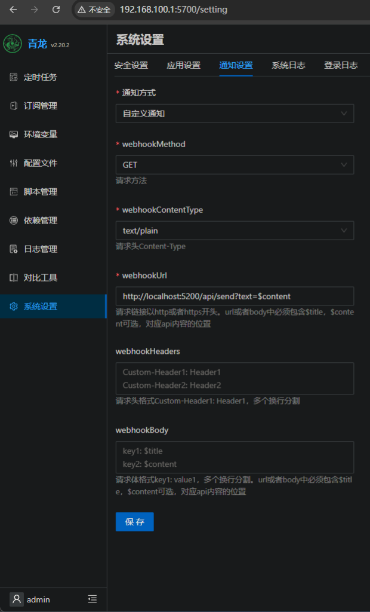
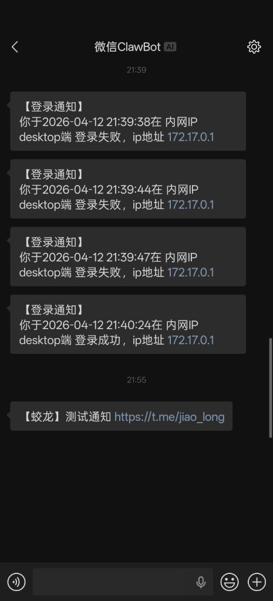
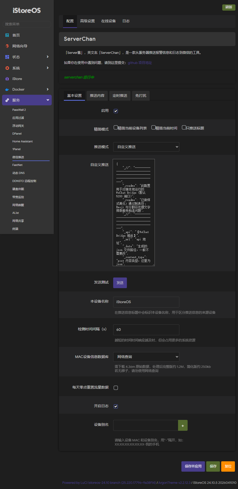

# 📡 API 接口参考

> 返回 [README](../README.md)

---

> 如果设置了 `API_TOKEN`，所有 API 请求需携带 `Authorization: Bearer <TOKEN>` 请求头，或在 URL 中添加 `?token=<TOKEN>` 参数。

## 发送消息

```bash
# 最简单：GET 请求，to 省略时自动发给第一个联系人
curl "http://localhost:5200/api/send?text=Hello!"

# POST JSON（指定联系人）
curl -X POST http://localhost:5200/api/send \
  -H "Content-Type: application/json" \
  -d '{"to": "好友名称", "text": "Hello!"}'
```

### 进阶功能

```bash
# 多播发送：逗号分隔多个联系人（每人间隔 0.5s 防风控）
curl "http://localhost:5200/api/send?to=老婆,家庭群&text=晚饭做好了"

# Markdown 降级：自动将 Markdown 转为微信友好的纯文本
curl "http://localhost:5200/api/send?text=**重要通知**&markdown=1"
```

---

## 快捷推送（兼容青龙面板 / ntfy / Bark）

这个接口专为第三方系统集成设计。如果未显式指定 `to`，系统会自动将消息发送给通讯录中的**第一个联系人**。

> ⚠️ 注意：每条推送都会消耗连续发送计数（10 条未回复则阻断）。如果你使用青龙面板或其他定时任务频繁推送，请确保用户及时回复以重置计数器。

### 基础调用

```bash
# GET 方式（最简单）
curl "http://localhost:5200/api/push?title=提醒&content=该喝水了&token=YOUR_TOKEN"

# POST JSON
curl -X POST http://localhost:5200/api/push \
  -H "Content-Type: application/json" \
  -H "Authorization: Bearer YOUR_TOKEN" \
  -d '{"to": "好友名称", "title": "提醒", "content": "消息内容"}'
```

### 在青龙面板中使用

前往青龙面板的 `系统设置` -> `通知设置`，按以下填写：

- **通知方式**：`自定义通知`
- **webhookMethod**：`GET`
- **webhookContentType**：`text/plain`
- **webhookUrl**：`http://你的IP:5200/api/send?text=$content&title=$title` *(如果设置了密码，末尾加 `&token=凭证`)*
- 其他选项保持默认留空。保存后点击测试，即可在微信中收到青龙的测试通知！

<div align="center">
  <table>
    <tr>
      <td align="center"></td>
      <td align="center"></td>
    </tr>
    <tr>
      <td align="center"><em>青龙面板通知设置</em></td>
      <td align="center"><em>微信收到通知效果</em></td>
    </tr>
  </table>
</div>

### 在 OpenWrt / iStoreOS 中使用（luci-app-wechatpush）

如果你使用 OpenWrt 或 iStoreOS 路由器，可以安装 [luci-app-wechatpush](https://github.com/tty228/luci-app-wechatpush)（微信推送），将路由器的**设备上下线、CPU 温度报警、登录提醒、定时状态报告**等事件自动推送到微信。

**配置步骤：**

1. 在 iStore 应用商店搜索安装 `微信推送`，或手动安装 `luci-app-wechatpush`
2. 前往 `服务` → `微信推送` → `配置` 页面
3. 推送模式选择 **「自定义推送」**
4. 在自定义推送文本框中粘贴以下 JSON：

```json
{
    "url": "http://你的路由器IP:5200/api/send",
    "data": "@${tempjsonpath}",
    "content_type": "Content-Type: application/json",
    "str_title_start": "",
    "str_title_end": "",
    "str_linefeed": "\\n",
    "str_splitline": "\\n┈┈┈┈┈┈┈┈┈┈┈┈┈┈┈┈┈\\n",
    "str_space": "  ➜  ",
    "str_tab": " 🔹 ",
    "type":
      {
        "to": "\"你的微信user_id\"",
        "text": "\"📌 ${1}\\n━━━━━━━━━━━━━━━━━\\n${2}\""
      }
}
```

5. 保存并应用，点击「发送测试」即可在微信中收到路由器推送

> 💡 **提示**：`to` 字段中的 `user_id` 可在微信中发送 `/uid` 指令获取。`url` 中的 IP 通常为路由器网关地址（如 `192.168.100.1`）。如设置了 `API_TOKEN`，在 URL 末尾追加 `?token=你的密钥`。

<div align="center">
  
  <br><em>luci-app-wechatpush 自定义推送配置页面</em>
</div>

---

## 发送图片

支持三种方式上传图片，Web 面板也可直接点击 🖼️ 按钮发送：

```bash
# 方式一：multipart/form-data（最通用，适合脚本和前端）
curl -X POST http://localhost:5200/api/send_image \
  -H "Authorization: Bearer YOUR_TOKEN" \
  -F "to=好友名称" \
  -F "image=@/path/to/photo.jpg"

# 方式二：JSON + Base64（适合程序化调用）
curl -X POST http://localhost:5200/api/send_image \
  -H "Content-Type: application/json" \
  -H "Authorization: Bearer YOUR_TOKEN" \
  -d '{"to": "好友名称", "image": "<base64编码的图片数据>"}'

# 方式三：裸二进制流（适合管道和流式处理）
curl -X POST "http://localhost:5200/api/send_image?to=好友名称&token=YOUR_TOKEN" \
  -H "Content-Type: application/octet-stream" \
  --data-binary @/path/to/photo.jpg
```

---

## Webhook 适配器

自动识别并格式化第三方服务的告警负载为微信友好文本：

```bash
# 指定类型：Grafana / GitHub / Uptime Kuma / Bark
curl -X POST http://localhost:5200/api/webhook/grafana \
  -H "Content-Type: application/json" \
  -d '{"status": "firing", "alerts": [{"labels": {"alertname": "HighCPU"}}]}'

# 自动检测：系统会根据字段特征自动识别来源
curl -X POST http://localhost:5200/api/webhook \
  -H "Content-Type: application/json" \
  -d '{"title": "下载完成", "message": "文件已就绪"}'
```

支持的 Webhook 格式：`grafana` · `github` · `uptimekuma` · `bark` · 通用自动检测

---

## 获取联系人列表

```bash
curl -H "Authorization: Bearer YOUR_TOKEN" http://localhost:5200/api/contacts
```

---

## 健康检查（无需鉴权）

```bash
curl http://localhost:5200/api/status
```

---

## ⚙️ 环境变量配置

| 环境变量 | 默认值 | 说明 |
|---------|--------|------|
| `PORT` | `5200` | 服务监听端口 |
| `WEBHOOK_URL` | _(空)_ | 外部 Webhook 地址，也可在 Web UI 中配置 |
| `WEBHOOK_ENABLED` | `false` | 是否开启外部 Webhook 转发 |
| `WEBHOOK_MODE` | `unknown_command` | 转发模式：`unknown_command` / `all_messages` |
| `WEBHOOK_TIMEOUT` | `5` | Webhook 请求超时（秒，1~30） |
| `API_TOKEN` | _(空)_ | API 鉴权 Token，未设置则无鉴权 |
| `TOKEN_FILE` | `/data/token.json` | 登录凭证持久化路径 |
| `CONTACTS_FILE` | `/data/contacts.json` | 联系人缓存路径 |
| `AI_CONFIG_FILE` | `/data/ai_config.json` | AI 助手配置文件路径 |
| `TZ` | `Asia/Shanghai` | 容器时区 |

---

## Webhook 推送格式

当开启外部 Webhook 后，收到微信消息时会向该地址发送 POST 请求。该能力默认关闭，可在 Web UI 的“系统设置 -> 外部 Webhook”中启用，也可通过环境变量启用。

```json
{
  "source": "wechat-bridge",
  "from_user": "用户ID",
  "from_name": "显示名",
  "text": "消息内容 (图片为 [图片:文件名], 视频为 [视频:文件名])",
  "msg_id": "消息ID",
  "timestamp": 1712345678,
  "msg_type": 1,
  "is_command": false,
  "command": "",
  "args": ""
}
```

说明：

- `unknown_command` 模式：仅未知 `/命令` 会转发到外部 Webhook，已知命令仍由 WeChat Bridge 本地处理。
- `all_messages` 模式：全部文本消息都会转发到外部 Webhook。
- 推荐使用异步回写：外部服务处理完后，再调用 `POST /api/send` 将结果回发到微信。
