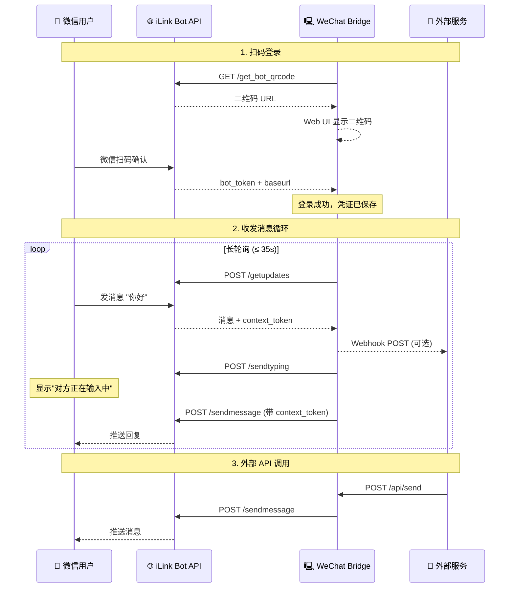

# 🏗️ 工作原理

> 返回 [README](../README.md)

---

## 架构时序图

---

## 核心流程说明

### 1. 扫码登录
Bridge 向 iLink API 请求二维码 URL，通过 Web UI 展示给用户。用户使用微信扫码后，API 返回 `bot_token` 和 `baseurl`，凭证持久化至 `/data/token.json`，后续启动自动复登。

### 2. 消息收发循环
采用 **长轮询** 机制（单次最长 35 秒），持续向 iLink API 拉取新消息。收到消息后：
- 解析文本/图片/视频内容
- 检测是否为内置指令（`/status`、`/help` 等）
- 若配置了 Webhook，将消息 POST 转发至外部服务
- 若启用了 AI 助手，调用对应模型生成回复
- 通过 `context_token` 回复消息（确保在 24h 窗口内）

### 3. 外部 API 调用
外部服务（青龙面板、自动化脚本等）通过 RESTful API 向 Bridge 发送消息请求，Bridge 转发至 iLink API 完成微信消息发送。
