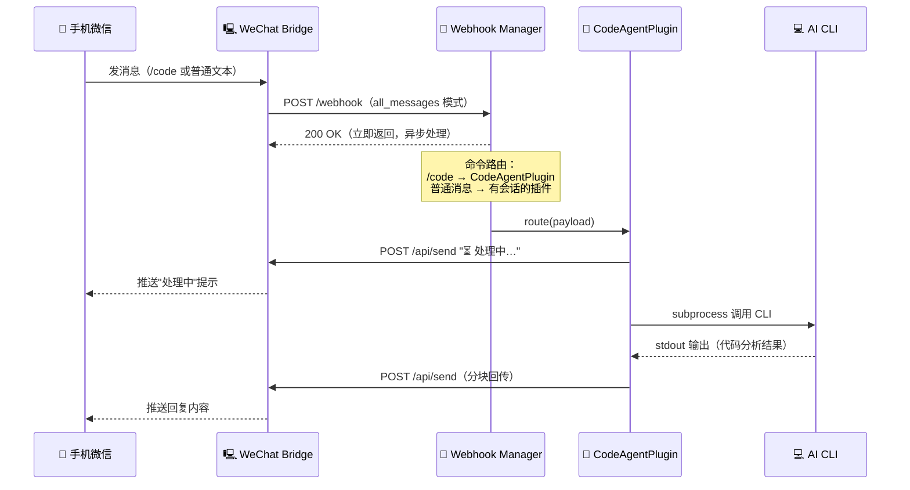
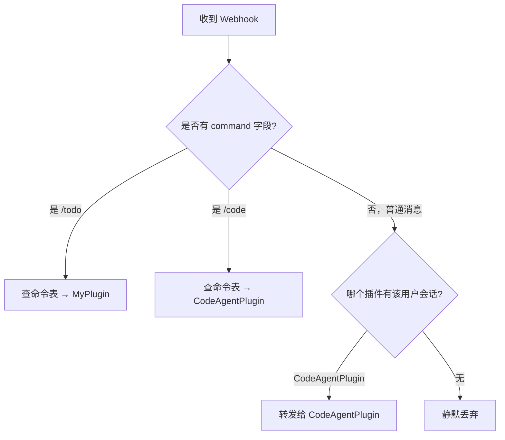
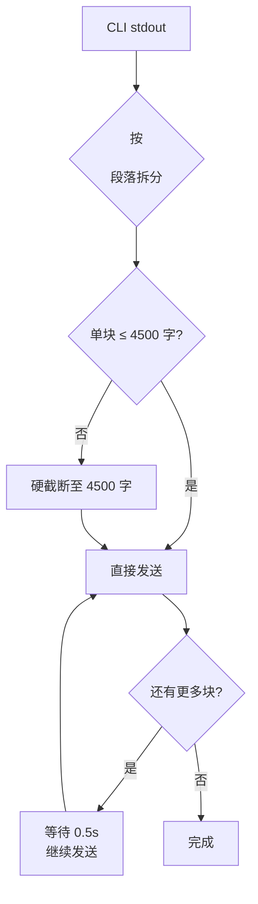

# 🤖 Bridge Code Agent

> 返回 [README](../README.md)

通过微信远程操控运行在 Mac 上的 AI CLI（Gemini / Claude Code / Codex），实现随时随地的代码审查、修改、构建等操作。

---

## 效果预览

```
你（手机微信）                        Mac
──────────────────────────────────────────────────────
/code wechat-bridge            →   开启会话，绑定项目目录

delivery.py 的限流逻辑是怎样的  →   Gemini CLI 执行
                               ←   DeliveryMixin 在 MAX_CONSECUTIVE_SENDS
                                   达到阈值后阻断发送，等待用户回复重置...

/switch claude                 →   切换到 Claude，重置 session
帮我给 _trigger_webhook 写单测  →   Claude Code 执行
                               ←   [生成单测代码回传]

/cli --list-sessions           →   透传 gemini --list-sessions
                               ←   Session 1: wechat-bridge (2026-05-10)

/exit                          →   关闭会话
                               ←   对话 4 轮 · $0.0821
```

---

## 工作原理



**关键设计点：**

- Bridge 向 Manager 发 Webhook 后**立即返回 200**，Manager 在后台线程处理，避免 Bridge 超时
- `all_messages` 模式将所有消息（包括普通文本）转发给 Manager，Manager 做命令路由和 session 检查，非会话消息零开销丢弃
- CLI 执行时间可达 180s，远超 Bridge Webhook 的 5s 超时，两者完全解耦
- 多个插件通过同一个 Webhook Manager 共用一个 HTTP Server 和端口

---

## 前置条件

| 条件 | 说明 |
|---|---|
| WeChat Bridge 已运行 | 已扫码登录，Bot 在线 |
| Mac 上已安装至少一个 AI CLI | `gemini`、`claude`、`codex` 之一 |
| AI CLI 已完成身份认证 | 各 CLI 首次使用需登录/配置 API Key |
| Python 3.9+ | 脚本运行环境，无第三方依赖 |

### 验证 AI CLI 可用性

```bash
# Gemini CLI
gemini -p "你好" --output-format text

# Claude Code
claude -p "你好" --output-format text

# Codex
codex exec "你好"
```

---

## 快速开始

### 第一步：配置 project_map.json

`examples/project_map.json` 定义了项目短名到本地路径的映射：

```json
{
  "wechat-bridge": "/Users/yourname/code/wechat-bridge"
}
```

按实际项目修改，短名就是你在微信里输入 `/code` 后跟的名字。

> **每次收到 `/code` 命令时实时读取此文件，修改后无需重启 Agent 即时生效。**

---

### 第二步：WeChat Bridge 配置

在 Bridge **Web UI → 系统设置 → 外部 Webhook** 中配置：

```
Webhook 已启用     ✅ 开启（新安装默认已开启）
Webhook 地址       http://127.0.0.1:18082/webhook   ← Agent 与 Bridge 在同一台 Mac 时用此地址
转发模式           全部消息（all_messages）          ← 必须选这个（新安装默认已选）
请求超时（秒）     5
```

> ⚠️ **转发模式必须选「全部消息」**
>
> 选「仅未知命令」时，session 中发送的普通对话文本（如"帮我分析这个函数"）会被 Bridge 拦截，Agent 永远收不到。

也可以用环境变量配置（Docker 部署时）：

```bash
WEBHOOK_URL=http://127.0.0.1:18082/webhook
WEBHOOK_ENABLED=true
WEBHOOK_MODE=all_messages
WEBHOOK_TIMEOUT=5
```

---

### 第三步：设置环境变量

```bash
export BRIDGE_BASE_URL=http://127.0.0.1:5200   # Bridge 地址
export BRIDGE_API_TOKEN=your-token              # 若 Bridge 设置了 API_TOKEN
export ALLOWED_USERS=o9xxxx@im.wechat           # 白名单，强烈建议设置
export DEFAULT_BACKEND=gemini                   # 默认 AI 后端
```

查看自己的 `user_id`：在微信里发送 `/uid`，Bot 会回复你的 ID。

---

### 第四步：启动

**推荐：通过 Webhook Manager 启动（支持多插件）**

```bash
cd /path/to/wechat-bridge
python3 examples/webhook_manager.py
```

**单独启动（仅加载 Code Agent）**

```bash
python3 examples/bridge_code_agent.py
```

两种方式均输出相同格式的启动日志：

```json
{"event": "plugin_loaded", "name": "bridge-code-agent", "commands": ["/code", "/switch", "/cli", "/exit"]}
{"event": "startup", "listen": "http://0.0.0.0:18082/webhook", "plugins": ["bridge-code-agent"], "commands": ["/code", "/switch", "/cli", "/exit"]}
{"event": "register_commands", "ok": true, "count": 4}
```

同时，微信里发送 `/help`，可以看到 `/code`、`/switch`、`/cli`、`/exit` 已注册到命令列表。

---

## 命令参考

### `/code <项目名> [后端]`

开启代码会话，绑定工作目录。

```
/code wechat-bridge           → 用默认后端（gemini）进入 wechat-bridge 项目
/code wechat-bridge claude    → 指定 claude 后端
/code wechat-bridge codex     → 指定 codex 后端
```

成功回复示例：

```
✅ 已进入 wechat-bridge

- 路径：/Users/yourname/code/wechat-bridge
- 后端：Gemini (gemini)
- 直接发消息与 AI 对话，/switch <后端> 切换，/cli <参数> 调用原生命令，/exit 退出
```

---

### `/switch <后端>`

在会话内切换 AI 后端，CLI session 重置，项目目录保持不变。

```
/switch claude   → 切换到 Claude Code
/switch codex    → 切换到 Codex
/switch gemini   → 切回 Gemini
```

---

### 普通消息

会话开启后，直接发送任意文本，Agent 转发给 AI CLI 执行：

```
delivery.py 的限流逻辑是怎样的
帮我给 _trigger_webhook 写单元测试
bridge.py 里有没有线程安全问题
```

---

### `/exit`

关闭当前会话，CLI session 状态清除。

---

## 后端对比

```mermaid
graph LR
    A[/code 开启会话] --> B{选择后端}
    B -->|gemini| C[Gemini CLI<br/>--approval-mode yolo<br/>--resume latest]
    B -->|claude| D[Claude Code<br/>--dangerously-skip-permissions<br/>-c 续接]
    B -->|codex| E[Codex<br/>--dangerously-bypass-approvals<br/>exec resume --last]
```

| 后端 | 优势 | session 恢复 | 自动执行 |
|---|---|---|---|
| **gemini** | 速度快，代码能力强 | `--resume latest`（按项目目录隔离） | `--approval-mode yolo` |
| **claude** | 长上下文，遵循指令准确 | `-c`（续接当前目录最近会话） | `--dangerously-skip-permissions` |
| **codex** | 代码专项能力 | `exec resume --last`（全局最近） | `--dangerously-bypass-approvals-and-sandbox` |

> **注意（codex）**：`exec resume --last` 续接的是全局最近一次 exec session，不区分项目目录。单用户单项目下无影响；交替使用多个项目时，建议 `/switch codex` 重置或重新 `/code` 进入。

---

## 扩展：自定义插件

Webhook Manager 支持从 `examples/` 目录**自动发现并加载**插件，无需修改 Manager 本身。

### 插件结构（三步）

**1. 实现插件类**

```python
# examples/my_plugin.py
from webhook_manager import BasePlugin

class MyPlugin(BasePlugin):
    name = "my-plugin"                   # 插件标识，用于日志

    @property
    def commands(self) -> list[str]:
        return ["/todo", "/note"]        # 本插件处理的命令

    def get_command_specs(self) -> list[dict]:
        return [
            {"command": "/todo", "description": "记录待办事项"},
            {"command": "/note", "description": "快速记笔记"},
        ]

    def handle(self, payload: dict) -> None:
        from_user = payload["from_user"]
        command   = payload.get("command", "")
        args      = payload.get("args", "")
        # 处理逻辑 ... 调用 /api/send 回写微信
```

**2. 声明 PLUGIN_CLASS**

```python
# 文件末尾
PLUGIN_CLASS = MyPlugin
```

**3. 启动**

```bash
python3 examples/webhook_manager.py
```

Manager 启动时自动扫描 `examples/*.py`，用 AST 预检（不执行文件）发现 `PLUGIN_CLASS` 声明，加载并注册。

---

### 路由规则



- **命令消息**：按注册的命令路由到对应插件，命令冲突时先加载的插件优先并记录警告
- **普通消息**：路由到 `has_session(user_id)` 返回 `True` 的插件（用于会话中的对话）
- **白名单过滤**：`ALLOWED_USERS` 在 Manager 层统一过滤，插件无需重复实现

---

### 有会话的插件

如果你的插件需要跟踪用户会话状态（如 Code Agent），覆盖 `has_session()`：

```python
def has_session(self, user_id: str) -> bool:
    return user_id in self._active_sessions
```

Manager 用此方法将普通消息路由到正确的插件。

---

## 环境变量

| 变量 | 默认值 | 说明 |
|---|---|---|
| `BRIDGE_BASE_URL` | `http://127.0.0.1:5200` | WeChat Bridge 地址 |
| `BRIDGE_API_TOKEN` | 空 | Bridge 的 API Token（若未设置可留空） |
| `WEBHOOK_LISTEN_HOST` | `0.0.0.0` | Manager HTTP Server 监听地址 |
| `WEBHOOK_LISTEN_PORT` | `18082` | Manager HTTP Server 监听端口 |
| `SESSION_TIMEOUT_MINUTES` | `30` | 空闲超时自动关闭（分钟） |
| `GEMINI_TIMEOUT` | `180` | 单次 CLI 执行超时（秒） |
| `ALLOWED_USERS` | 空（不限制） | 白名单 user_id，逗号分隔 |
| `DEFAULT_BACKEND` | `gemini` | 默认 AI 后端 |

---

## 消息流与分块逻辑

AI CLI 的输出可能很长（几千字的代码分析），Agent 会自动分块回传：



多块时自动加编号前缀：`(1/3)`、`(2/3)`、`(3/3)`，避免微信大段文字渲染问题。

---

## 常见问题

**Q：发消息没有任何反应**

按顺序排查：
1. Bridge 的 Webhook 模式是否为「全部消息」？
2. Manager 是否正在运行？检查终端日志
3. `ALLOWED_USERS` 是否包含了你的 `user_id`？（发 `/uid` 查看）
4. Webhook 地址是否可达？在 Mac 上 `curl -X POST http://127.0.0.1:18082/webhook -d '{}'`

**Q：回复 `⚠️ 找不到 gemini 命令`**

AI CLI 未在 PATH 中。验证：`which gemini`。如果用 nvm / brew 安装，确认 Manager 启动时的 shell 环境包含正确的 PATH。

**Q：回复 `⚠️ Gemini 执行超时`**

单次超时默认 180s。可以调大：`export GEMINI_TIMEOUT=300`。也可能是任务过重，考虑拆分问题。

**Q：`/switch` 后第一条消息很慢**

正常，切换后第一次调用不带 resume（新建 CLI session），启动开销略高。

**Q：session 自动关闭了**

默认 30 分钟空闲后自动关闭。调整：`export SESSION_TIMEOUT_MINUTES=60`。

**Q：我的插件没有被自动发现**

检查：
1. 文件在 `examples/` 目录下，文件名不以 `_` 开头
2. 在模块**最外层**（非函数/类内部）有 `PLUGIN_CLASS = YourClass` 赋值语句
3. 运行 `python3 examples/webhook_manager.py` 观察日志中是否有 `plugin_load_error`

---

## 安全说明

- **白名单必填**：`ALLOWED_USERS` 为空时，任何人给 Bot 发消息都能触发 AI CLI 在你的 Mac 上执行代码。强烈建议设置。
- **`yolo` 模式风险**：三个 CLI 均以自动执行模式运行，不会弹确认框。确保只有可信用户在白名单内。
- **本地执行**：Manager 与 CLI 均运行在 Mac 本地，无数据上传到第三方（除 AI CLI 本身的 API 调用）。

---

## 相关文档

- [异步 Webhook 集成指南](webhook-async-reply.md)
- [API 接口参考](api-reference.md)
- [工作原理](architecture.md)
- [iStoreOS 部署](istoreos.md)
