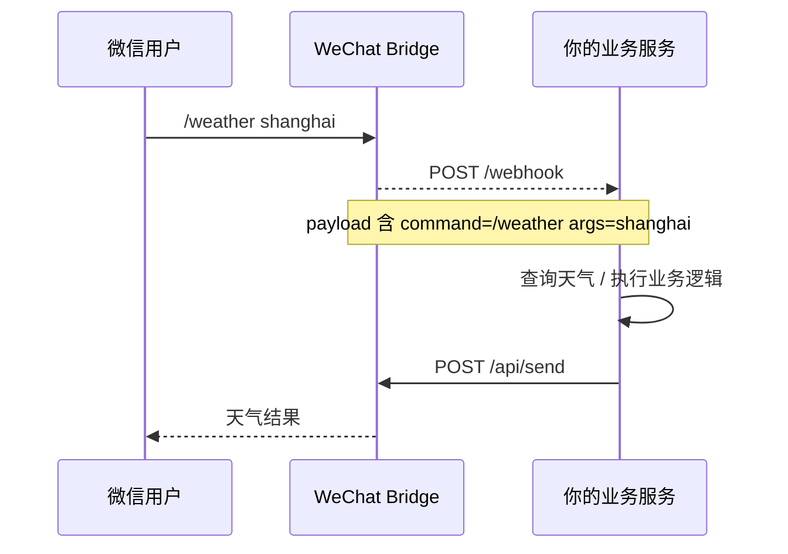

# 🔁 异步回写集成指南

> 返回 [README](../README.md)

---

## 适用场景

如果你希望把 `WeChat Bridge` 作为基建层使用，而把真正的业务逻辑放在自己的服务里，推荐使用这套模式：

1. 微信用户给 Bot 发消息
2. `WeChat Bridge` 将消息转发到你的外部 Webhook
3. 你的服务处理业务逻辑
4. 你的服务再调用 `POST /api/send`，把结果异步回写到微信

这比同步等待 Webhook 返回内容更稳，也更符合 `WeChat Bridge` 的边界定位。

---

## 推荐架构



---

## 第一步：开启外部 Webhook

在 Web UI 的 `系统设置 -> 外部 Webhook` 中配置：

- `Webhook 已启用`
- `Webhook 地址`：你的服务地址，例如 `http://192.168.100.2:18080/webhook`
- `转发模式`
  - `仅未知命令`：推荐。已知命令仍由 Bridge 本地处理
  - `全部消息`：所有文本消息都转发给你的服务
- `请求超时（秒）`：一般 `5` 到 `10` 足够

也可以用环境变量：

```bash
WEBHOOK_URL=http://192.168.100.2:18080/webhook
WEBHOOK_ENABLED=true
WEBHOOK_MODE=unknown_command
WEBHOOK_TIMEOUT=5
```

---

## 第二步：接收 WeChat Bridge 的 Webhook

`WeChat Bridge` 会向你的服务发送 JSON：

```json
{
  "source": "wechat-bridge",
  "from_user": "o9cq80xxxx@im.wechat",
  "from_name": "张三",
  "text": "/weather shanghai",
  "msg_id": "123456",
  "timestamp": 1712345678,
  "msg_type": 1,
  "is_command": true,
  "command": "/weather",
  "args": "shanghai"
}
```

字段说明：

- `from_user`：回写时最关键，后续需要把它作为 `/api/send` 的 `to`
- `text`：原始消息文本
- `is_command`：是否由命令触发
- `command`：命令名，例如 `/weather`
- `args`：命令参数，例如 `shanghai`

---

## 第三步：异步回写到微信

你的服务处理完后，调用 `WeChat Bridge` 的 `POST /api/send`：

```bash
curl -X POST http://192.168.100.1:5200/api/send \
  -H "Content-Type: application/json" \
  -H "Authorization: Bearer YOUR_TOKEN" \
  -d '{
    "to": "o9cq80xxxx@im.wechat",
    "text": "上海天气：22°C，多云"
  }'
```

如果没有设置 `API_TOKEN`，可以省略 `Authorization` 请求头。

---

## 最小示例

仓库里已经提供了一个最小可运行示例：

[`examples/webhook_receiver.py`](../examples/webhook_receiver.py)

它会：

- 接收 `WeChat Bridge` 的 Webhook
- 解析 `command / args`
- 调用 `/api/send` 异步回写

启动方式：

```bash
export BRIDGE_BASE_URL=http://192.168.100.1:5200
export BRIDGE_API_TOKEN=YOUR_TOKEN
python3 examples/webhook_receiver.py
```

然后在微信里发送：

```text
/weather shanghai
```

或：

```text
/echo hello
```

---

## 调试建议

### 1. 先验证 Webhook 是否收到

看你的服务日志里有没有收到：

- `command`
- `args`
- `from_user`

如果没收到，先检查：

- `Webhook 地址` 是否可达
- `WEBHOOK_ENABLED` 是否为 `true`
- `Webhook 模式` 是否符合预期

### 2. 再验证 `/api/send` 是否成功

如果外部服务已经收到 Webhook，但微信没有回消息，重点排查：

- `to` 是否使用了 `from_user`
- `API_TOKEN` 是否正确
- `WeChat Bridge` 是否仍在线

### 3. 用 `unknown_command` 模式最容易联调

推荐先把模式设成 `仅未知命令`，然后发：

```text
/weather shanghai
```

这样不会影响 `/help`、`/status` 等现有内置命令。

---

## 失败处理建议

- Webhook 超时：外部服务应尽快返回 `200 OK`，真正业务逻辑放后台执行
- 异步回写失败：外部服务应记录失败日志，并按需做有限次重试
- 不建议让 `WeChat Bridge` 同步等待业务服务计算完成后再回复微信

---

## 推荐实践

- `WeChat Bridge` 只做桥接和通用能力
- 你的私有服务负责天气、资产、提醒、Agent 等业务逻辑
- 外部服务统一通过 `/api/send` 回写

这样后续无论你把业务服务换成：

- Python Flask / FastAPI
- Node.js Express
- Dify / FastGPT 工作流
- 自己的 Agent 服务

`WeChat Bridge` 都不需要改业务代码。
