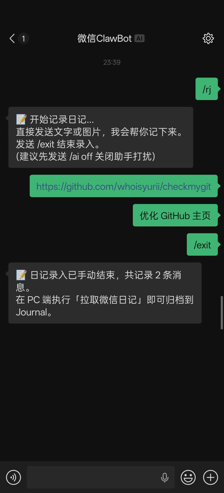
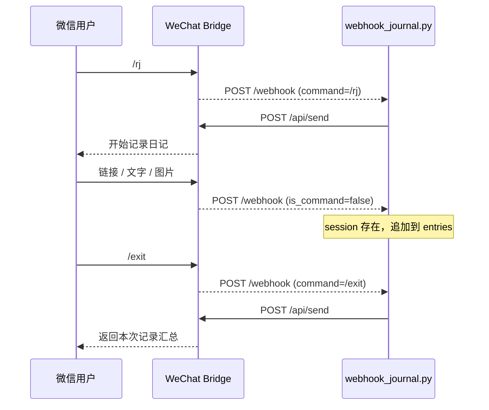

# 📝 Webhook 日记示例

> 返回 [README](../README.md) · 参阅 [异步回写集成指南](webhook-async-reply.md)

本示例用 [`examples/webhook_journal.py`](../examples/webhook_journal.py) 完整搭建一个“微信日记收集器”：

1. 在微信发送 `/rj` 开始记录
2. 后续发送文字、链接或图片
3. 发送 `/exit` 结束
4. 外部服务汇总本次 session，并通过 `/api/send` 回写到微信

这个模式适合日记、待办收集、灵感 inbox、问卷填写、多步表单等需要“连续收集多条消息”的场景

---

## 效果

<div align="center">
  
  <br><em>在微信中用 /rj 开始记录，发送多条内容后用 /exit 结束</em>
</div>

实际使用时，可以把 `/rj` 当成微信里的快速收集入口。例如先发 GitHub 链接，再补充“优化 GitHub 主页”这样的任务描述，结束后再由 PC 端脚本归档到 Journal、Obsidian、Notion 或其他系统

---

## 第一步：启动 WeChat Bridge

先启动 WeChat Bridge 并完成扫码登录，确保 Web UI 能正常收发消息

如果设置了 `API_TOKEN`，后面启动示例服务时要把同一个值填到 `BRIDGE_API_TOKEN`

---

## 第二步：启动日记 Webhook 服务

在仓库根目录运行：

```bash
export BRIDGE_BASE_URL=http://192.168.100.1:5200
export BRIDGE_API_TOKEN=YOUR_TOKEN
python3 examples/webhook_journal.py
```

如果 WeChat Bridge 就跑在本机，也可以使用默认地址：

```bash
export BRIDGE_BASE_URL=http://127.0.0.1:5200
python3 examples/webhook_journal.py
```

启动成功后会看到类似输出：

```json
{"event":"startup","listen":"http://0.0.0.0:18081/webhook","bridge_base_url":"http://127.0.0.1:5200","bridge_api_token_set":true,"session_timeout_minutes":30,"start_commands":["/note","/rj"]}
```

---

## 第三步：配置 Webhook

在 WeChat Bridge 的 Web UI 中打开 `系统设置 -> 外部 Webhook`，填写：

| 配置项 | 值 |
|---|---|
| Webhook | 开启 |
| Webhook 地址 | `http://你的机器IP:18081/webhook` |
| 转发模式 | `全部消息` |
| 请求超时 | `5` 到 `10` 秒 |

也可以用环境变量配置：

```bash
WEBHOOK_URL=http://你的机器IP:18081/webhook
WEBHOOK_ENABLED=true
WEBHOOK_MODE=all_messages
WEBHOOK_TIMEOUT=5
```

> `webhook_journal.py` 必须使用 `all_messages` 模式，否则 session 中的普通文本和图片不会转发到外部服务

---

## 第四步：在微信里使用

```text
/rj                                ← 开始记录
https://github.com/whoisyurii/...  ← 记录一条链接
优化 GitHub 主页                    ← 记录一条文字
/exit                              ← 结束并汇总
```

`/note` 也可以启动记录，它是兼容旧示例的别名

建议在测试前先发送 `/ai off`，避免内置 AI 助手同时回复造成干扰

---

## 工作流程



---

## 核心逻辑

日记示例使用内存 session 管理每个用户的录入状态：

```python
sessions: dict[str, NoteSession] = {}
```

收到 `/rj` 或 `/note` 时创建 session：

```python
if command in START_COMMANDS:
    start_session(from_user, from_name)
```

收到普通消息时，只有当前用户存在 session 才记录：

```python
if has_session:
    record_message(from_user, text)
```

收到 `/exit` 时结束 session 并回写汇总：

```python
if command in EXIT_COMMANDS:
    end_session(from_user, reason="user_exit")
```

非 session 用户的普通消息会在入口处快速忽略，所以 `all_messages` 不会导致所有聊天都进入业务逻辑

---

## 环境变量

| 变量 | 默认值 | 说明 |
|---|---|---|
| `WEBHOOK_LISTEN_HOST` | `0.0.0.0` | Webhook 服务监听地址 |
| `WEBHOOK_LISTEN_PORT` | `18081` | Webhook 服务监听端口 |
| `BRIDGE_BASE_URL` | `http://127.0.0.1:5200` | WeChat Bridge 地址 |
| `BRIDGE_API_TOKEN` | 空 | WeChat Bridge 的 `API_TOKEN` |
| `SESSION_TIMEOUT_MINUTES` | `30` | Session 无新消息后的自动结束时间 |

---

## 改造成自己的业务

你主要需要改三个函数：

- `start_session()`：改开始提示语，或初始化你的业务状态
- `record_message()`：把消息写入数据库、文件、队列、Notion、Obsidian、Journal 等
- `end_session()`：结束时生成摘要、推送结果、触发归档或通知

如果要长期保存，建议把 `sessions` 中的 entries 写入 SQLite、JSONL、Redis 或你自己的业务数据库，而不是只保存在内存里

---

## 其他示例

仓库还保留了一个更简单的一问一答示例：

- [`examples/webhook_receiver.py`](../examples/webhook_receiver.py)：适合 `/weather`、`/echo`、工具调用这类无状态命令，`unknown_command` 模式即可

---

## 下一步

- 了解异步回写流程 → [异步回写集成指南](webhook-async-reply.md)
- 查看 Webhook payload 字段 → [API 接口参考](api-reference.md#webhook-推送格式)
