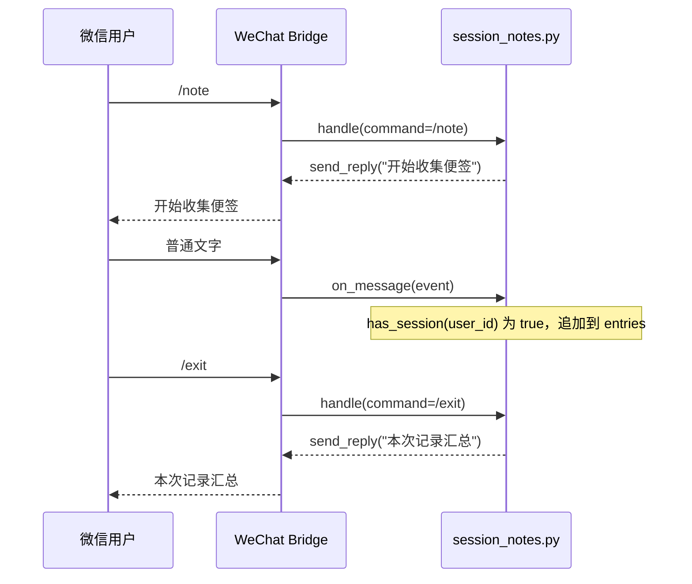

# 📝 插件示例：会话式便签

> 返回 [README](../README.md) · 参阅 [插件开发指南](plugin-development.md)

本示例用 [`examples/session_notes.py`](../examples/session_notes.py) 演示一个有状态插件：

1. 在微信发送 `/note` 开始收集
2. 后续普通文字自动进入当前 session
3. 发送 `/exit` 结束
4. 插件把本次 session 汇总后直接回写微信

这个模式适合便签、待办收集、灵感 inbox、问卷填写、多步表单等需要“连续收集多条消息”的场景。

---

## 使用方式

默认部署会自动扫描 `examples/` 中声明了 `PLUGIN_CLASS` 的插件；Docker 镜像也会包含这些通用 examples。

启动 WeChat Bridge 并扫码登录后，在微信里发送：

```text
/note                 ← 开始收集
https://github.com/... ← 记录一条链接
优化 GitHub 主页       ← 记录一条文字
/exit                 ← 结束并汇总
```

如果启用了 AI 自动回复，建议测试前先发送 `/ai off`，避免 AI 回复和插件回复同时出现。

---

## 工作流程


```mermaid
sequenceDiagram
    participant User as 微信用户
    participant Bridge as WeChat Bridge
    participant Plugin as session_notes.py

    User->>Bridge: /note
    Bridge->>Plugin: handle(command=/note)
    Plugin-->>Bridge: send_reply("开始收集便签")
    Bridge-->>User: 开始收集便签

    User->>Bridge: 普通文字
    Bridge->>Plugin: on_message(event)
    Note over Plugin: has_session(user_id) 为 true，追加到 entries

    User->>Bridge: /exit
    Bridge->>Plugin: handle(command=/exit)
    Plugin-->>Bridge: send_reply("本次记录汇总")
    Bridge-->>User: 本次记录汇总
```

---

## 核心逻辑

插件用内存字典管理每个用户的 session：

```python
sessions: dict[str, NoteSession] = {}
```

收到 `/note` 时创建 session：

```python
if command == START_COMMAND:
    self._start_session(from_user, from_name)
```

收到普通消息时，只有当前用户存在 session 才记录：

```python
if not text or text.startswith("/") or not self.has_session(from_user):
    return
```

收到 `/exit` 时结束 session 并回写汇总：

```python
if command == EXIT_COMMAND:
    self._end_session(from_user, reason="user_exit")
```

非 session 用户的普通消息会被快速忽略，不会进入业务逻辑。

---

## 配置

| 变量 | 默认值 | 说明 |
|---|---|---|
| `SESSION_TIMEOUT_MINUTES` | `30` | Session 无新消息后的自动结束时间 |

如果你希望使用 manifest，可以放入 `examples/` 子目录：

```text
examples/session-notes/
├── plugin.json
└── plugin.py
```

---

## 改造成自己的业务

常见改动点：

- `_start_session()`：改开始提示语，或初始化你的业务状态
- `on_message()`：把消息写入数据库、文件、队列、Notion、Obsidian 等
- `_end_session()`：结束时生成摘要、推送结果、触发归档或通知

如果要长期保存，建议把 entries 写入 SQLite、JSONL、Redis 或你自己的业务数据库，而不是只保存在内存里。

---

## 其他示例

- [`examples/webhook_receiver.py`](../examples/webhook_receiver.py)：适合 `/天气 深圳`、`/echo` 这类无状态命令
- [`examples/forwarder.py`](../examples/forwarder.py)：把所有入站消息转发到 `FORWARD_URLS`
- [`examples/bridge_code_agent.py`](../examples/bridge_code_agent.py)：通过微信远程驱动 AI CLI
